# VELORA System Diagrams

**Version:** 1.0.0

All diagrams use Mermaid syntax. Render in GitHub, VS Code, or any Mermaid-compatible viewer.

---

## Overall Architecture

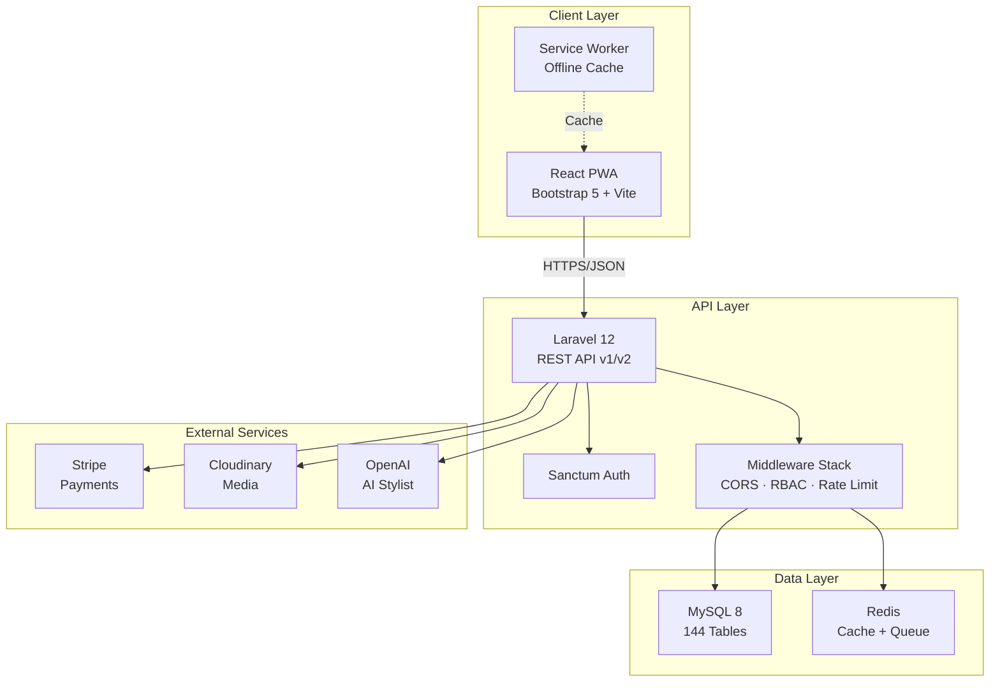

---

## Frontend Flow

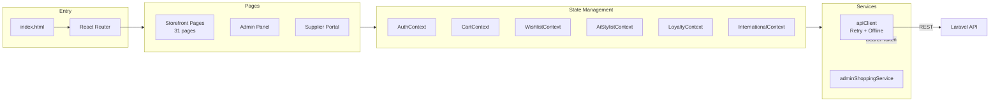

---

## Backend Flow

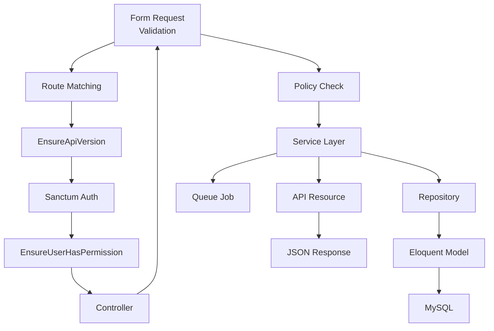

---

## Authentication Flow

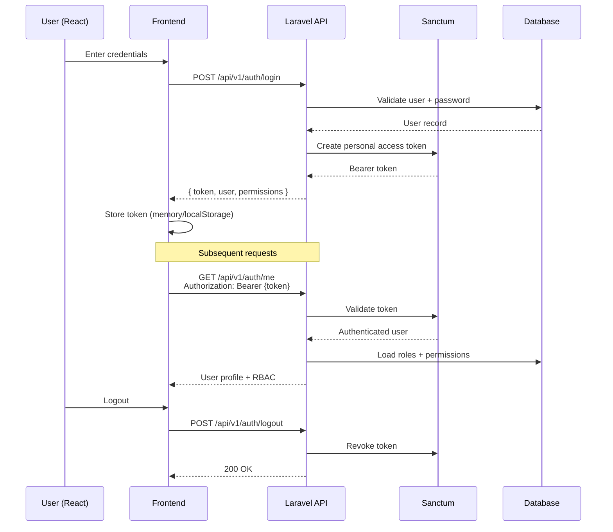

---

## AI Recommendation Flow

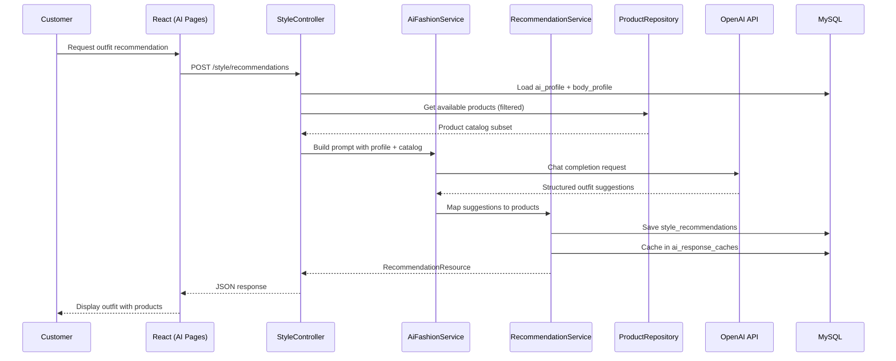

---

## Wardrobe Flow

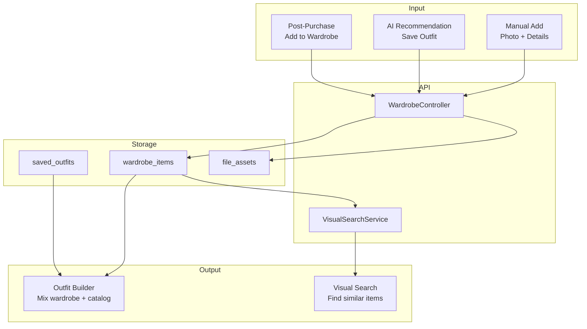

---

## Creator Commerce Flow

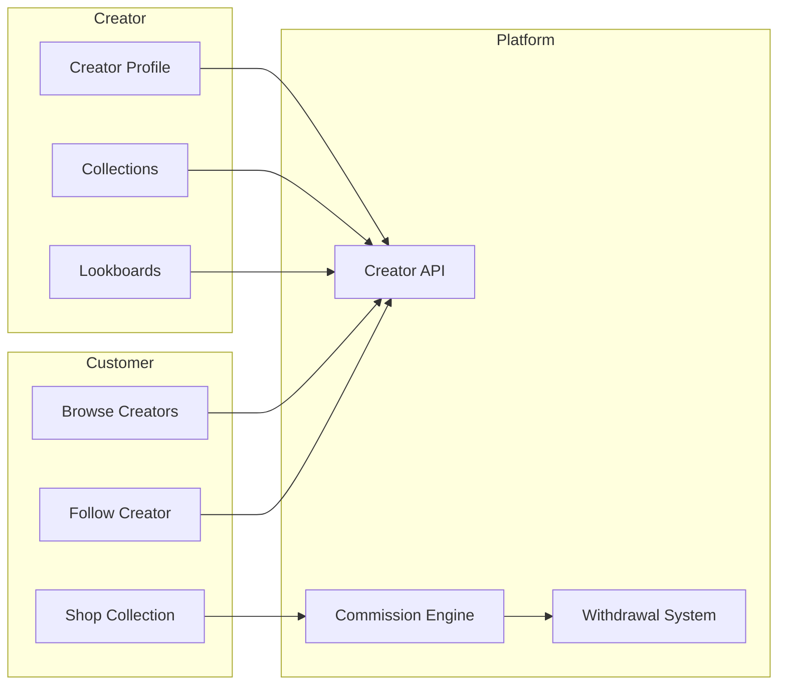

---

## International Commerce Flow

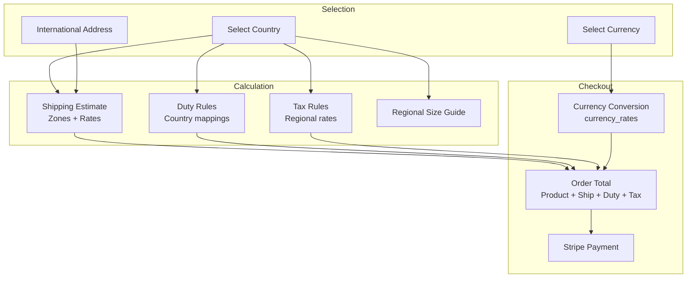

---

## Database ER Diagram (Core Entities)

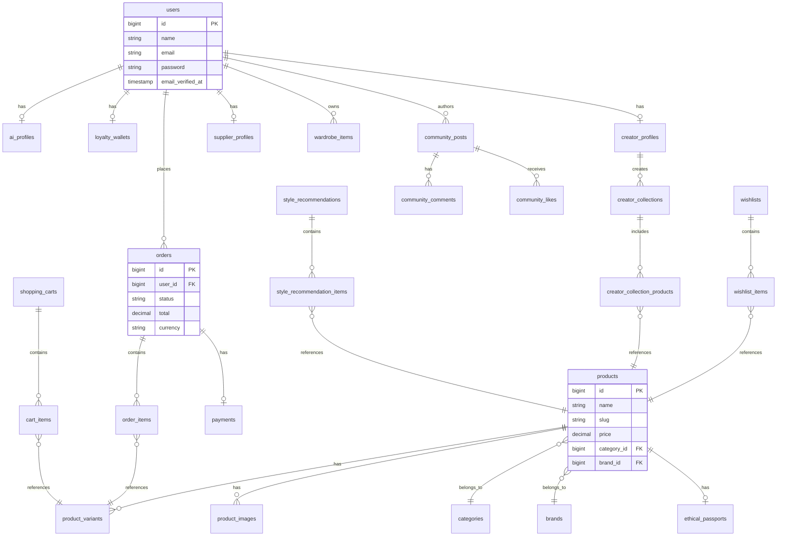

---

## Admin Architecture

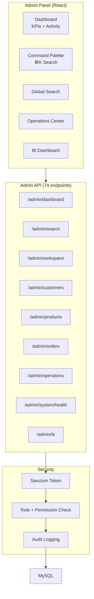

---

## Deployment Architecture

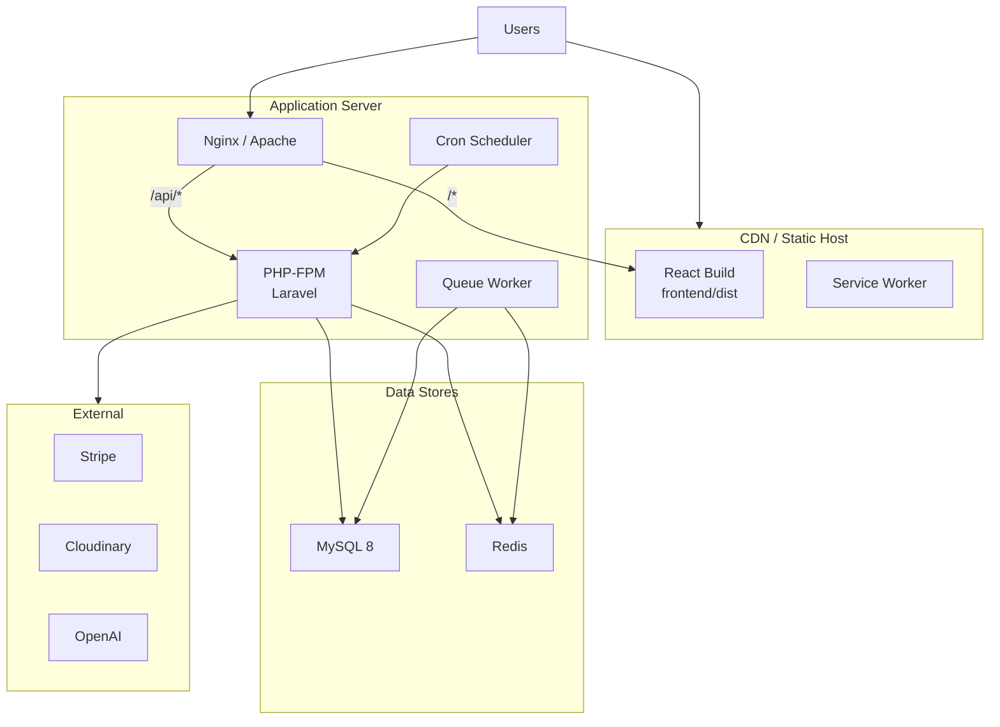
