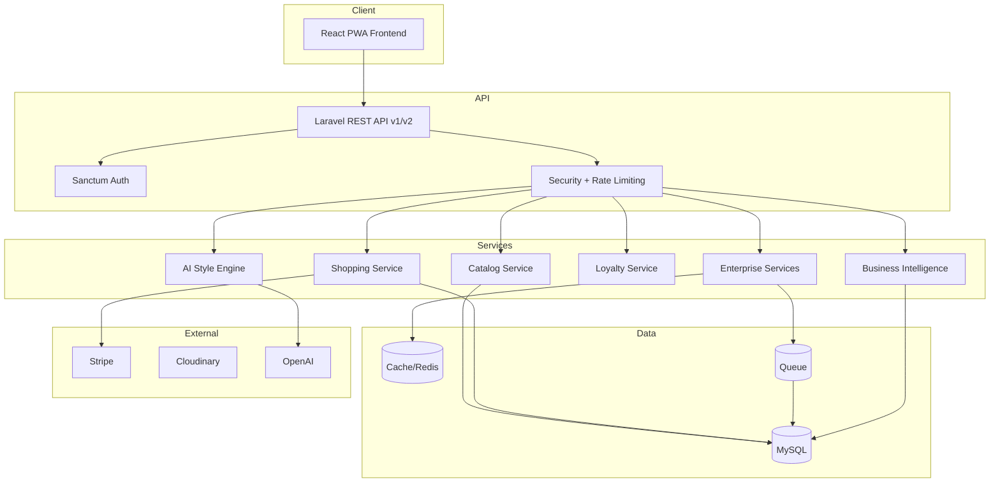

# Architecture Documentation

## System Overview

## Layering

- **Controllers** — HTTP boundary, validation, authorization
- **Services** — business logic (shopping, loyalty, AI, enterprise)
- **Models** — Eloquent ORM with relationships
- **Jobs** — async processing (email, webhooks, backups, exports)
- **Middleware** — security headers, API versioning, upload validation, slow query logging

## Frontend

- React 18 with React Router
- Bootstrap 5 + custom VELORA design system
- Axios API client with retry and session handling
- Vite build with PWA plugin and manual code splitting
- Lazy-loaded admin and supplier portals

## Security Model

- Sanctum bearer tokens for API authentication
- Role-based access (`super-admin`, `admin`, `customer`, `creator`, `supplier`)
- Permission middleware on admin endpoints
- Secrets read exclusively from Laravel `.env`

## Deployment Topology

- Nginx serves React `dist/` and proxies `/api` to PHP-FPM
- Queue worker processes background jobs
- Scheduler runs maintenance, backups, and cache warming
- Docker Compose available for local and staging environments
