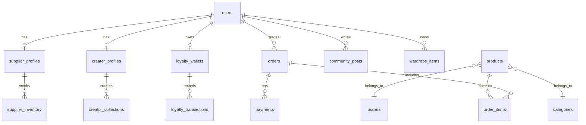

# Database Schema Documentation

VELORA uses MySQL with Laravel migrations. All tables use integer primary keys with indexed foreign keys.

## Core Domains

### Authentication & Authorization
- `users` — accounts with roles via `role_user`
- `roles`, `permissions`, `permission_role`
- `personal_access_tokens` — Sanctum API tokens
- `password_histories`, `user_devices`, `security_login_events`

### Catalog
- `products`, `product_variants`, `product_images`, `categories`, `brands`, `tags`
- `colors`, `sizes`, `inventories`, `inventory_logs`

### Shopping
- `shopping_carts`, `cart_items`, `wishlists`, `wishlist_items`
- `shipping_addresses`, `billing_addresses`, `shipping_methods`, `shipping_rates`
- `coupons`, `coupon_usages`
- `orders`, `order_items`, `order_status_history`
- `payments`, `payment_transactions`, `return_requests`

### Creator & Community
- `creator_profiles`, `creator_collections`, `creator_collection_products`
- `creator_follows`, `creator_commissions`, `creator_withdrawals`
- `lookboards`, `lookboard_items`, `wardrobe_items`, `visual_searches`
- `community_posts`, `community_comments`, `community_likes`, `community_bookmarks`

### Loyalty & Passport
- `loyalty_wallets`, `loyalty_transactions`, `referral_codes`, `referrals`
- `gift_cards`, `product_alerts`, `ethical_passports`, `ethical_passport_evidence`

### International Commerce
- `countries`, `states`, `cities`, `currencies`, `currency_rates`
- `shipping_zones`, `delivery_rules`, `duty_rules`, `warehouses`, `warehouse_inventory`

### Supplier Operations
- `supplier_profiles`, `supplier_addresses`, `supplier_inventory`
- `purchase_orders`, `supplier_shipments`, `supplier_returns`

### Admin & BI
- `settings`, `content_entries`, `support_tickets`, `support_messages`
- `admin_notifications`, `activity_logs`, `report_exports`
- `bi_analytics_events`, `bi_forecasts`, `bi_dashboard_snapshots`

### Enterprise
- `audit_logs`, `application_metrics`, `backup_runs`, `feature_flags`
- `incoming_webhook_events`, `scheduled_task_runs`, `file_assets`

## ER Diagram

## Cascade Rules

- Order items cascade delete with orders
- Community comments cascade delete with posts
- Loyalty transactions cascade delete with wallets
- User deletion restricted when orders exist (`restrictOnDelete`)

## Indexes

Status columns on `orders`, `products`, `community_posts`, and `support_tickets` are indexed. Foreign keys are indexed by Laravel conventions.

## Soft Deletes

`products` uses soft deletes. All other core tables use hard deletes with cascade rules.
